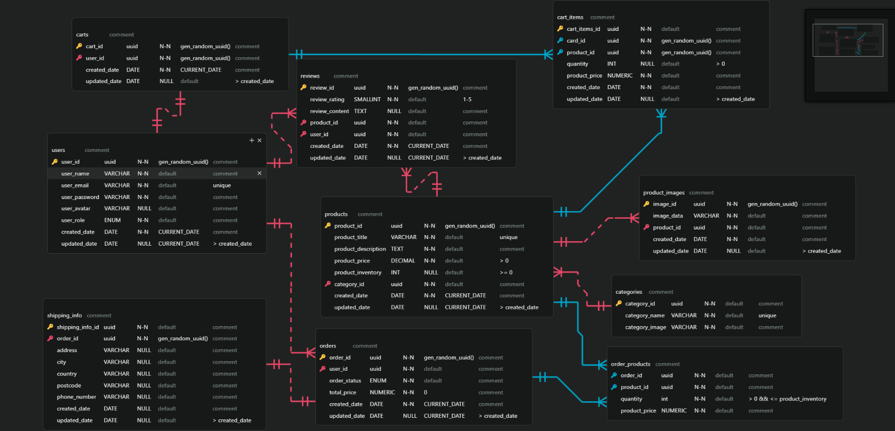

# Fullstack Project of Binh Nguyen - Ecommerce inspiration


## Project Description

The project was done as a final project at [Integrify](https://www.integrify.io/) bootcamp. It will offer core functionality concepts for a typical Ecommerce Website.

### Project overview

This repository contains the backend server for an E-Commerce Platform. The project implements RESTful API endpoints for managing users, products, orders, carts, categories, and reviews.

**NOTE**: The frontend repository can be found [here]()
Link to deployed page of the frontend:

## Table of Contents

- [Technologies](#technologies)
- [Getting start](#getting-start)
- [Folder structure](#folder-structure)
- [Relational database design](#relational-database-design)
- [Functionalities](#functionalities)
- [RESTful API design](#restful-api-design)
- [CLEAN Architecture](#clean-architecture)
- [Data flow](#data-flow-of-the-application:)
- [Extensive design](#extensive-design)

## Technologies

- **Frontend**: TailwindCSS, TypeScript, React, Redux Toolkit
- **Backend**: ASP.NET Core, Entity Framework Core, PostgreSQL
- **Testing**: Jest for frontend and XUnit, Moq for backend
- **Deployment**:

## Getting start

1. Open your terminal and clone the front-end repository with the following command:

```
git clone https://github.com/tripplen23/fs17-Frontend-project.git
```

2. Next, clone the back-end repository:

```
git clone https://github.com/tripplen23/fs17_CSharp_FullStack.git
```

3. Navigate the Web API layer in the back-end directory.

```
  cd Backend_Ecommerce
  cd Backend_Ecommerce/Ecommerce.WebAPI
```

4. Set up your database connection in `appsettings.json` file with these values, replace them with your own database info:

```
  "Logging": {
    "LogLevel": {
      "Default": "Information",
      "Microsoft.AspNetCore": "Warning"
    }
  },
  "AllowedHosts": "*",
  "ConnectionStrings": {
    "Localhost": "Host=localhost;Username=<your db username>;Database=<your db name>;Password=<your password>" // Password is optional depend if the user setup the password for admin or not
  },
  "Secrets": {
    "JwtKey": "[Your JWT Key]",
    "Issuer": "[Your Custom Name]"
  }
```

5. Try to build the application

```
dotnet build
```

6. If build successfully, run this command to create a new Migrations folder, which stores the snapshot of all the database context changes:
   _If there is already a folder Migrations in the Web API layer, delete it._

```
dotnet ef database drop
dotnet ef migrations add Create
```

7. Apply all the changes to the database

```
dotnet ef database update
```

8. Then run the backend

```
dotnet watch
```

9. Then navigate to the Frontend Project, install all the necessary dependencies

```
npm install
```

10. Then run the frontend

```
npm start
```

## Folder structure

```
.
├── Backend_Ecommerce
│   ├── Backend_Ecommerce.sln
│   ├── Ecommerce.Controller
│   │   ├── Ecommerce.Controller.csproj
│   │   └── src
│   │       └── Controller
│   │           ├── AuthController.cs
│   │           ├── CartController.cs
│   │           ├── CategoryController.cs
│   │           ├── OrderController.cs
│   │           ├── ProductController.cs
│   │           ├── ReviewController.cs
│   │           └── UserController.cs
│   ├── Ecommerce.Core
│   │   ├── Ecommerce.Core.csproj
│   │   └── src
│   │       ├── Common
│   │       │   ├── AppException.cs
│   │       │   ├── BaseQueryOptions.cs
│   │       │   ├── ProductQueryOptions.cs
│   │       │   ├── UserCredential.cs
│   │       │   └── UserQueryOptions.cs
│   │       ├── Entity
│   │       │   ├── CartAggregate
│   │       │   |	  ├── Cart.cs
│   │       │   |	  └── CartItem.cs
│   │       │   ├── OrderAggregate
│   │       │   |	  ├── Order.cs
│   │       │   |	  └── OrderProduct.cs
│   │       │   ├── BaseEntity.cs
│   │       │   ├── Category.cs
│   │       │   ├── Product.cs
│   │       │   ├── ProductImage.cs
│   │       │   ├── Review.cs
│   │       │   ├── ShippingInfo.cs
│   │       │   ├── TimeStamp.cs
│   │       │   └── User.cs
│   │       ├── RepoAbstract
│   │       │   ├── ICartItemRepo.cs
│   │       │   ├── ICartRepo.cs
│   │       │   ├── ICategoryRepo.cs
│   │       │   ├── IOrderRepo.cs
│   │       │   ├── IProductImageRepo.cs
│   │       │   ├── IProductRepo.cs
│   │       │   ├── IReviewRepo.cs
│   │       │   └── IUserRepo.cs
│   │       └── ValueObject
│   │           ├── OrderStatus.cs
│   │           └── UserRole.cs
│   ├── Ecommerce.Service
│   │   ├── Ecommerce.Service.csproj
│   │   └── src
│   │       ├── DTO
│   │       │   ├── CartDto.cs
│   │       │   ├── CartItemDto.cs
│   │       │   ├── CategoryDto.cs
│   │       │   ├── OrderDto.cs
│   │       │   ├── OrderProductDto.cs
│   │       │   ├── ProductImageDto.cs
│   │       │   ├── ProductDto.cs
│   │       │   ├── ReviewDto.cs
│   │       │   ├── ShippingInfoDto.cs
│   │       │   └── UserDto.cs
│   │       ├── Service
│   │       │   ├── AuthService.cs
│   │       │   ├── CartItemService.cs
│   │       │   ├── CartService.cs
│   │       │   ├── CategoryService.cs
│   │       │   ├── OrderService.cs
│   │       │   ├── ProductService.cs
│   │       │   ├── ReviewService.cs
│   │       │   └── UserService.cs
│   │       ├── ServiceAbstract
│   │       │   ├── IAuthService.cs
│   │       │   ├── ICartItemService.cs
│   │       │   ├── ICartService.cs
│   │       │   ├── ICategoryService.cs
│   │       │   ├── IOrderService.cs
│   │       │   ├── IPasswordService.cs
│   │       │   ├── IProductImageService.cs
│   │       │   ├── IProductService.cs
│   │       │   ├── IReviewService.cs
│   │       │   ├── ITokenService.cs
│   │       │   └── IUserService.cs
│   │       └── Shared
│   │           └── MapperProfile.cs
│   ├── Ecommerce.Test
│   │   ├── Ecommerce.Test.csproj
│   │   └── src
│   │       ├── Core
│   │       │   └── removeme.txt
│   │       └── Service
│   │           ├── CategoryServiceTest.cs
│   │           ├── OrderServiceTest.cs
│   │           ├── ProductServiceTests.cs
│   │           ├── ReviewServiceTest.cs
│   │           └── UserServiceTest.cs
│   ├── Ecommerce.WebAPI
│   │   ├── Ecommerce.WebAPI.csproj
│   │   ├── Ecommerce.WebAPI.http
│   │   ├── Properties
│   │   │   └── launchSettings.json
│   │   ├── appsettings.Development.json
│   │   ├── appsettings.json
│   │   └── src
│   │       ├── AuthorizationPolicy
│   │       |   ├── AdminOrOwnerAccountRequirement.cs
│   │       │   ├── AdminOrOwnerCartRequirement.cs
│   │       │   ├── AdminOrOwnerOrderRequirement.cs
│   │       │   └── AdminOrOwnerReviewRequirement.cs
│   │       ├── Database
│   │       |   ├── AppDbContext.cs
│   │       │   ├── SeedingData.cs
│   │       │   └── TimeStampInterceptor.cs
│   │       ├── ExternalService
│   │       │   ├── PasswordService.cs
│   │       │   └── TokenService.cs
│   │       ├── Middleware
│   │       │   └── ExceptionHandlerMiddleware.cs
│   │       ├── Program.cs
│   │       └── Repo
│   │           ├── CategoryRepo.cs
│   │           ├── OrderRepo.cs
│   │           ├── ProductRepo.cs
│   │           ├── ReviewRepo.cs
│   │           └── UserRepo.cs
└── README.md
```

## Relational database design



## Functionalities


## RESTful API design

Check [/Endpoints](https://github.com/yuankeMiao/fs17_CSharp_8-BackendTeamwork/tree/main/Endpoints) folder for all api endpoints and the usage, or click the links below to check descriptions and example request & response for each endpoint.


## CLEAN Architecture


This project follows the principles of Clean Architecture, emphasizing separation of concerns and modularity. It is organized into several layers, each with distinct responsibilities.

1. Core Domain Layer (Ecommerce.Core)

- Centralizes core domain logic and entities.
- Includes common functionalities, repository abstractions, and value objects.

2. Application Service Layer (Ecommerce.Service)

- Implements business logic and orchestrates interactions between controllers and the core domain.
- Services handle DTO transformations and business operations related to each resource.

3. Controller Layer (Ecommerce.Controller)

- Contains controllers responsible for handling HTTP requests and responses.
- Controllers are organised by resource types (e.g., Auth, Category, Order, Product, Review, User).

4. Infrastructure Layer (Ecommerce.WebAPI)

- Manages infrastructure tasks and interaction with external systems.
- Contains database context, repositories, and middleware for error handling.

5. Testing Layer (Ecommerce.Test)

- Holds unit tests for core domain and application services.
- Ensures the reliability and correctness of the implemented functionalities.

### Data flow of the application:


### Testing

Run tests:

- Navigate to root folder of backend module, then run the test

```
dotnet test
```

## Extensive design
